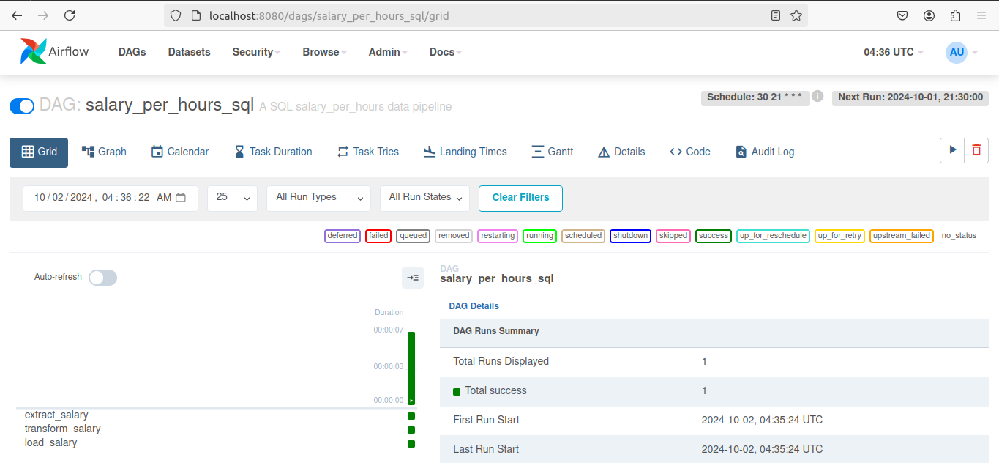

markdown

# salary per hour calculation Project

This repository consists of two different environments for analyzing salary data:

1. **salary_notebooks**: For data analysis using Jupyter notebooks.
2. **salary_data_pipelines**: For orchestrating the ETL process with Apache Airflow.

## Table of Contents

- [Data Processing Overview](#data-processing-overview)
- [How to Run](#how-to-run)
  - [1. Cloning the Repository](#1-cloning-the-repository)
  - [2. Running salary_notebooks](#2-running-salary_notebooks)
  - [3. Running salary_data_pipelines](#3-running-salary_data_pipelines)
- [Notes](#notes)

## Data Processing Overview

### SQL Code

- **Base Tables**: 
  - CSV: `timesheets.csv`, `employees.csv`
  - SQL: `timesheets`, `employees`
  
- **Final Table**:
  - CSV: `data/transform/sql/salary_per_hours.csv`
  - SQL: `salary_per_hours_sql`

- **Data Pipelines script**
  - ETL: salary_project/salary_data_pipelines/scripts/sql/*
  - Orchestrator: salary_project/salary_data_pipelines/dags/sql/*

- **Scheduler**
  - use airflow, run each day at 21.30 --> cron statements: '30 21 * * *',

### Python Code

- **Base Tables**: 
  - CSV: `timesheets.csv`, `employees.csv`
  - SQL: `timesheets_python`, `employees_python`
  
- **Final Table**:
  - CSV: `data/transform/python/salary_per_hours.csv`
  - SQL: `salary_per_hours_python`

- **Data Pipelines script**
  - ETL: salary_project/salary_data_pipelines/scripts/python/*
  - Orchestrator: salary_project/salary_data_pipelines/dags/python/*

- **Scheduler**
  - use airflow, run each day at 21.30 --> cron statements: '30 21 * * *',

## How to Run

### 1. Cloning the Repository

To get started, clone the repository:

```bash
git clone <repository-url>
cd <repository-name>
```

### 2. Running salary_notebooks

Navigate to the salary_notebooks directory:

```bash
cd salary_notebooks
```

Build and run the Docker container:

```bash
docker compose up --build
```

Open your web browser and go to: http://localhost:8888

Access the notebooks, where all analysis code is located.

Notebooks Overview

    Python_per_hour_salary:
        The transformation result will be stored in data/transform/python/salary_per_hours.csv.
        If the folder doesn't exist initially, run the code first to create it.

    SQL_per_hour_salary:
        The transformation result will be stored in data/transform/sql/salary_per_hours.csv.
        If the folder doesn't exist initially, run the code first to create it.

### 3. Running salary_data_pipelines

Navigate to the salary_data_pipelines directory:

```bash
cd salary_data_pipelines
```

Build and run the Docker container:

```bash
docker compose up --build
```
Open your web browser and go to: http://localhost:8080

username: admin

password: admin

DAGs Overview
    - for running dags, just turn on the button on the left
    
    - you can run manually with button on top left
    

    dags/python_salary_dags:
        Contains the orchestrator for Python code (scripts/python/*).
        All scheduling settings are configured in this script.
        The transformation result will be stored in data/transform/python/salary_per_hours.csv.
        If the folder doesn't exist initially, run the dags in airflow first to create it.

    dags/sql_salary_dags:
        Contains the orchestrator for SQL code (scripts/sql/*).
        All scheduling settings are configured in this script.
        The transformation result will be stored in data/transform/sql/salary_per_hours.csv.
        If the folder doesn't exist initially, run dags in airflow first to create it.

Notes

For salary_notebooks:
- If you want to run iterative updates on Python_per_hour_salary.ipynb, you should restart Docker first, update the CSV, and then the changed data will be generated.
- The notebooks have different code compared to salary_data_pipelines, which includes starter code for the ETL process. The complete ETL process is detailed in salary_data_pipelines.

For salary_data_pipelines:

- If you want to run iterative updates on Python_per_hour_salary.ipynb, you don't need to restart Docker. Simply update the CSV and rerun the DAGs in Airflow to generate the changed data.
- Use the following command to check the generated tables in the database:
```  bash
your-computer:your-computer$ docker exec -it {postgres_container_id} psql -U airflow -d airflow

airflow=# \dt
airflow=# SELECT * FROM salary_per_hours_python;
airflow=# SELECT * FROM salary_per_hours_sql;
```